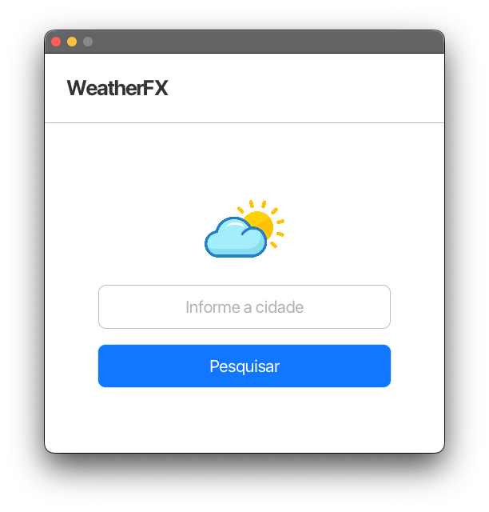
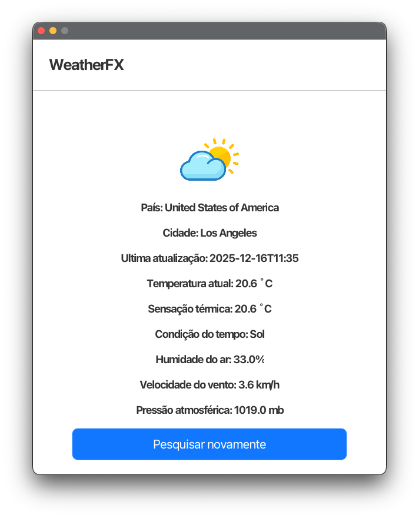
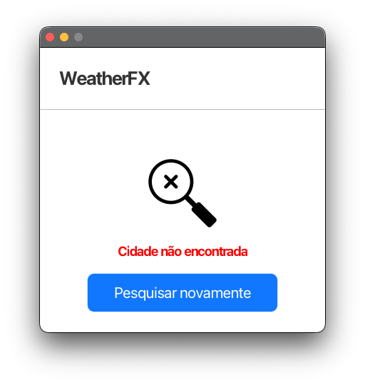

# Climatic App (WeatherFX)

## Resumo / Summary

- pt-BR: Aplicação desktop JavaFX para consulta do tempo (WeatherFX). UI construída com JavaFX; comunica-se com a WeatherAPI usando `java.net.http` e converte respostas com `org.json`.
- en-US: JavaFX desktop application to query weather (WeatherFX). UI built with JavaFX; it uses `java.net.http` to call WeatherAPI and `org.json` to parse responses.

## Principais mudanças (essa versão)

- Migração para interface gráfica com JavaFX (`App`, `components/`, `resources/style.css`).
- Projeto modular com `module-info.java` (requisições: `java.net.http`; JSON: `org.json`; JavaFX modules).
- Uso de `api_key.txt` na raiz para armazenar a chave da Weather API.

## Requisitos / Requirements

- Java 11 ou superior instalado
- JavaFX SDK (versão compatível com sua JVM) — no macOS baixe em https://openjfx.io/
- `json.jar` (ou `org.json` jar) — coloque em `lib/` ou registre como dependência do módulo
- `api_key.txt` na raiz do projeto contendo a chave da API (apenas a chave em uma linha)

Observação: o `module-info.java` atual requer o módulo `org.json`. Se usar um JAR sem nome de módulo, o JAR será tratado como módulo automático — coloque-o em `lib/` e inclua `lib` no `--module-path`.

## Estrutura do projeto / Project structure

- `src/` – código-fonte Java (pacotes: `components`, `models`, `services`, `dto`)
- `src/com/github/joaogavalentim/climatic/app/resources/style.css` – estilos JavaFX
- `api_key.txt` – chave da WeatherAPI (não comitar)
- `lib/` – local sugestivo para `json.jar` e outras libs externas

## Como compilar e executar (macOS) / How to compile and run (macOS)

Recomendo usar uma IDE (IntelliJ/VS Code) e configurar o JavaFX SDK + adicionar `lib/json.jar` como biblioteca do módulo. Se preferir linha de comando, exemplo:

1) Ajuste os caminhos abaixo conforme seu sistema:
# Climatic App (WeatherFX)



> Aplicação desktop JavaFX para consulta de clima — GUI moderna e leve. /
> JavaFX desktop app to query weather — modern and lightweight GUI.

[](https://openjdk.java.net/)
[](https://openjfx.io/)
[](#license--license)

---

## Índice / Table of Contents

- [Resumo / Summary](#climatic-app-weatherfx)
- [Principais mudanças](#principais-mudanças-essa-versão)
- [Requisitos / Requirements](#requisitos--requirements)
- [Instalação rápida / Quick setup (macOS)](#como-compilar-e-executar-macos--how-to-compile-and-run-macos)
- [Uso / Usage](#uso--usage)
- [Estrutura do projeto / Project structure](#estrutura-do-projeto--project-structure)
- [Contribuição / Contributing](#contribuição--contributing)
- [Licença / License](#licença--license)

---

## Resumo / Summary

- pt-BR: Aplicação desktop JavaFX para consulta do tempo (WeatherFX). UI construída com JavaFX; comunica-se com a WeatherAPI usando `java.net.http` e converte respostas com `org.json`.
- en-US: JavaFX desktop application to query weather (WeatherFX). UI built with JavaFX; it uses `java.net.http` to call WeatherAPI and `org.json` to parse responses.

## Principais mudanças (essa versão)

- Migração para interface gráfica com JavaFX (`App`, `components/`, `resources/style.css`).
- Projeto modular com `module-info.java` (requisições: `java.net.http`; JSON: `org.json`; JavaFX modules).
- Uso de `api_key.txt` na raiz para armazenar a chave da Weather API.

## Requisitos / Requirements

- Java 11 ou superior instalado
- JavaFX SDK (versão compatível com sua JVM) — no macOS baixe em https://openjfx.io/
- `json.jar` (ou `org.json` jar) — coloque em `lib/` ou registre como dependência do módulo
- `api_key.txt` na raiz do projeto contendo a chave da API (apenas a chave em uma linha)

Observação: o `module-info.java` atual requer o módulo `org.json`. Se usar um JAR sem nome de módulo, o JAR será tratado como módulo automático — coloque-o em `lib/` e inclua `lib` no `--module-path`.

## Estrutura do projeto / Project structure

- `src/` – código-fonte Java (pacotes: `components`, `models`, `services`, `dto`)
- `src/com/github/joaogavalentim/climatic/app/resources/style.css` – estilos JavaFX
- `api_key.txt` – chave da WeatherAPI (não comitar)
- `lib/` – local sugestivo para `json.jar` e outras libs externas
- `.github/img/` – imagens usadas no README e documentação (ex: `app.png`, `weather.png`, `error.png`)

Exemplos de tela:

 

## Como compilar e executar (macOS) / How to compile and run (macOS)

Recomendo usar uma IDE (IntelliJ/VS Code) e configurar o JavaFX SDK + adicionar `lib/json.jar` como biblioteca do módulo. Se preferir linha de comando, exemplo:

1) Ajuste os caminhos abaixo conforme seu sistema:

```bash
JAVA_HOME=/Library/Java/JavaVirtualMachines/jdk-17.jdk/Contents/Home
JAVAFX_LIB=/path/to/javafx-sdk-20/lib
```

2) Coloque `json.jar` dentro de `lib/` na raiz do projeto.

3) Compile (modo modular):

```bash
mkdir -p out
javac --module-path "$JAVAFX_LIB":lib --add-modules javafx.controls,javafx.fxml,javafx.graphics -d out $(find src -name "*.java")
```

4) Execute (modo modular):

```bash
java --module-path "$JAVAFX_LIB":lib --add-modules javafx.controls,javafx.fxml,javafx.graphics -m climatic.app/com.github.joaogavalentim.climatic.app.App
```

Notas:
- Se seu `json.jar` não expor o módulo `org.json` automaticamente, coloque `json.jar` em `lib/` e execute pela IDE ou ajuste o `--module-path`.
- Em ambientes com `module-info` ativo, usar a IDE costuma ser mais simples para configurar `module-path` e libs.

## Execução rápida sem módulos (alternativa)

Se preferir executar sem módulos (remover/ignorar `module-info.java`) — não recomendado aqui — compile adicionando os jars ao `classpath` e execute com as opções do JavaFX:

```bash
mkdir -p out
javac -d out -cp "lib/json.jar:$JAVAFX_LIB/*" $(find src -name "*.java")
java -cp "out:lib/json.jar:$JAVAFX_LIB/*" --add-opens java.base/java.lang=ALL-UNNAMED com.github.joaogavalentim.climatic.app.App
```

Esse modo pode exigir ajustes e não respeita `module-info.java`.

## Configuração na IDE (sugestão)

- IntelliJ IDEA: adicione o JavaFX SDK em `Project Structure > Libraries` e configure a Run Configuration com VM options: `--module-path /path/to/javafx-sdk/lib --add-modules javafx.controls,javafx.fxml` e adicione `lib/json.jar` à lista de módulos/libraries.
- VS Code: use extensão Java + configure `java.project.referencedLibraries` para incluir `lib/json.jar` e passe `--module-path` e `--add-modules` em settings/run tasks.

## Uso / Usage

1. Crie/edite `api_key.txt` na raiz com sua chave da WeatherAPI (WeatherAPI.com).  
2. Abra o app (executando os comandos acima ou rodando pela IDE).  
3. Na interface, digite o nome da cidade e clique em "Pesquisar".  
4. A tela exibirá os dados retornados ou uma mensagem de cidade não encontrada.

## Dependências externas / External dependencies

- JavaFX SDK (obrigatório)
- `json.jar` (org.json)
- Acesso à Internet para chamadas à WeatherAPI

## Erros comuns / Troubleshooting

- `IOException` lendo `api_key.txt`: confirme se o arquivo existe e tem permissão de leitura.
- Erro de módulo não encontrado: verifique `--module-path` e se `lib/json.jar` está presente.
- Erros do JavaFX: confirme compatibilidade entre versão do JavaFX e JDK.

## Contribuição / Contributing

- Abra issues para bugs e pedidos de melhoria.
- Para contribuições: fork → branch → PR. Siga o padrão do código e adicione descrições claras.

## Licença / License

Este repositório não possui licença definida. Para publicar publicamente, adicione um arquivo `LICENSE` (ex: MIT, Apache-2.0).

---

Se quiser, eu adiciono também um `README_pt-BR.md` e `README_en-US.md` separados, ou um `build.sh` para macOS que automatize compilação e execução com JavaFX e `lib/json.jar`.

